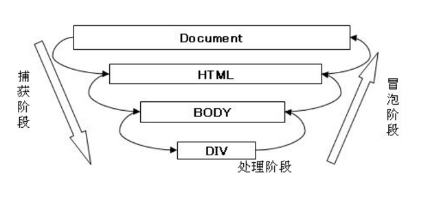

## DOM事件流
DOM事件流包括三个阶段:
- 事件捕获阶段
- 处于目标阶段
- 事件冒泡阶段



#### 事件捕获阶段
当事件发生时，首先发生的是事件捕获，为父元素截获事件提供了机会。

```ecmascript 6
    button.onclick = function() {
      console.log('1. You click Button');
    };
    document.body.onclick = function() {
      console.log('2. You click body');
    };
    document.onclick = function() {
      console.log('3. You click document');
    };
    window.onclick = function () {
        console.log('4. You click window 冒泡');
    };
    window.addEventListener('click', function() {
        console.log('4. You click window 捕获');
    }, true);
    /* 
      4. You click window 捕获
      1. You click Button
      2. You click body
      3. You click document 
      4. You click window 冒泡
    */
```
可以看到，点击事件先被父元素截获了，且该函数只在事件捕获阶段起作用。

#### 处于目标与事件冒泡阶段
事件到了具体元素时，在具体元素上发生，并且被看成冒泡阶段的一部分。
随后，冒泡阶段发生，事件开始冒泡。

##### note:
1. 所有现代浏览器都支持事件冒泡，但在具体实现中略有差别：

IE9、Firefox、Chrome、和Safari则将事件一直冒泡到window对象。

2. IE9、Firefox、Chrome、Opera、和Safari都支持事件捕获。尽管DOM标准要求事件应该从document对象开始传播，但这些浏览器都是从window对象开始捕获事件的。

#### 阻止事件冒泡
- 方法: stopPropagation()
- 不影响父元素的事件捕获。

#### 阻止事件捕获
- 方法: preventDefault()
