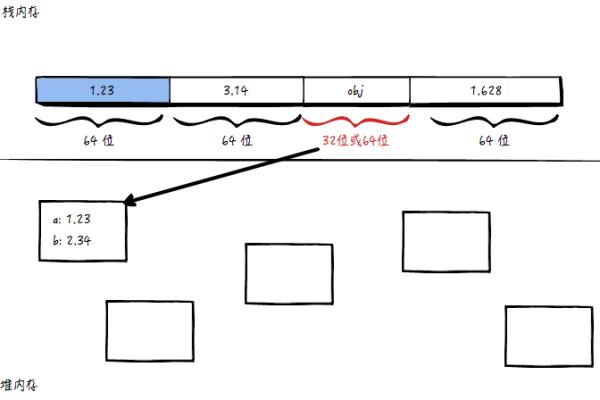
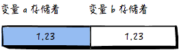
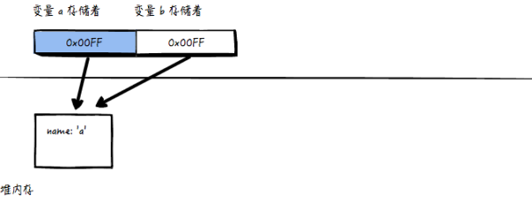

### js基本类型和复杂类型
js的简单数据类型（也称为基本数据类型）：Undefined、Null、Boolean、Number和String。

复杂的数据类型：Object。

其中Undefined、Null、Boolean、Number都属于基本类型。

Object、Array和Function则属于引用类型，String有些特殊。
### 基本类型和复杂类型
* 基本类型变量存的是值，复杂类型的变量存的是内存地址。
* 基本类型在赋值的时候拷贝值，复杂类型在赋值的时候只拷贝地址，不拷贝值。

```javascript
    var obj = {
        a : 1.23,
        b : 2.34
    }
```
下面我们来看下obj是如何存储的：

计算机将程序里的内存分成两种：

（1）按顺序使用用内，每个数据占据的位数是固定的，这种内存叫做「栈内存」；

（2）专门用来存储位数不固定的数据，存的时候不一样按顺序一个一个存，这种内存叫做「堆内存」。


如图， obj 在栈内存那里，只占固定位数（32位或64位或其他都可以），里面存的并不是数据{a:1.23,b:2.34}，里面存的是数据「在内存中的位置」（类似于引用或者指针）。

堆内存里，会开辟一块空间来存放 {a:1.23, b:2.34}。

「如果我再给 obj 添加一个属性c呢？obj.c = 3.45，那么 obj.c 依旧会放到堆内存，同时占用的内存空间也会动态的变化」

### 值v.s.引用
* 如果变量存储的是原始值，那么这个变量就是值类型，在 JS 里也叫做基本类型。
* 如果变量存储的是内存位置，那么这个变量就是引用类型，在 JS 里也叫复杂类型，也就是对象。
* 值类型在赋值的时候是直接拷贝的，而引用类型则只拷贝地址。

##### 值类型的赋值举例：
```javascript
    var a = 1.23;
    var b = a;
```
对应的内存结果为：




##### 引用类型的赋值举例：
```javascript
    var a = { name : 'a'};
    var b = a;
```

对应的内存结果为：



也就是说，a和b都存储着「同一块内存」的地址！那么当我们修改 b.name 的时候，a.name 也会跟着变：

```javascript
    b.name = 'b';
    a.name === 'b' //true
```
