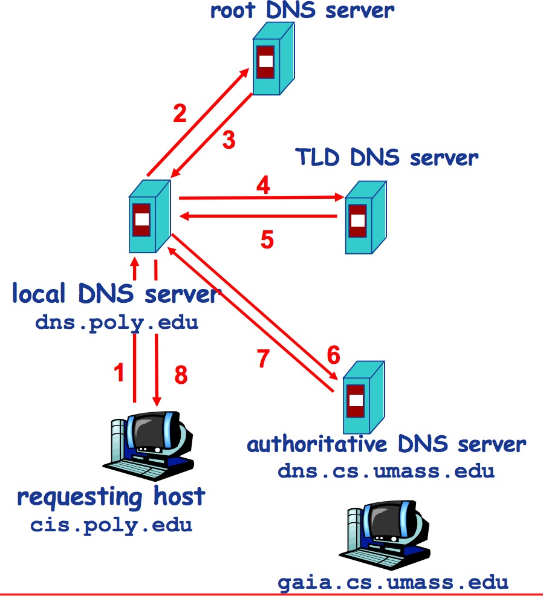
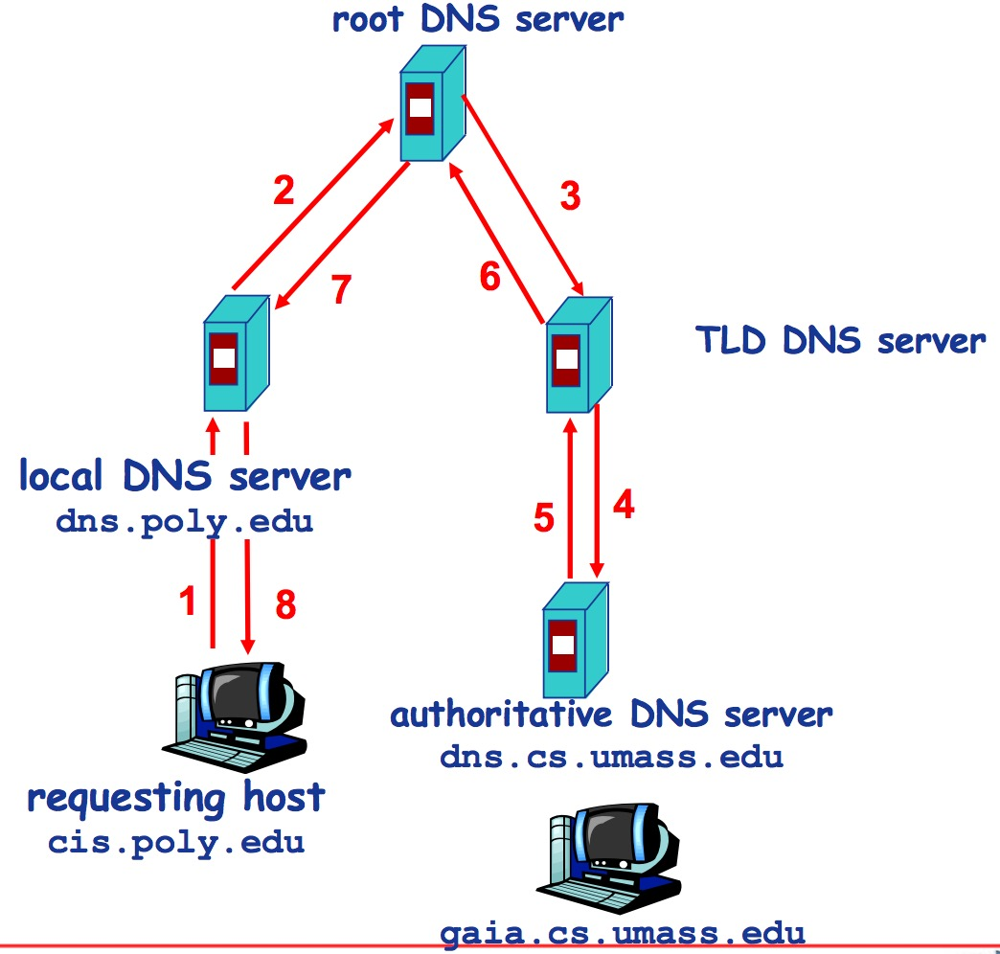

## DNS域名解析
#### 根域名服务器
* 获得映射，向本地域名服务器返回映射

#### 顶级域名服务器(TLD, top-level domain)
* 负责com, org, net,edu等
* 顶级域名和国家顶级域名，例如cn, uk, fr等

#### 权威(Authoritative)域名服务器
* 组织的域名解析服务器，提供组织内部服务器的解析服务

#### 迭代查询

#### 递归查询
