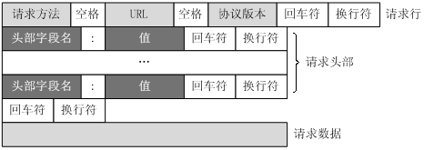

## HTTP简介
* HTTP是一个基于TCP/IP通信协议来传递数据（HTML 文件, 图片文件, 查询结果等）。
* HTTP是一个属于应用层的面向对象的协议。
* HTTP协议工作于客户端-服务端架构(CS)为上。浏览器作为HTTP客户端通过URL向HTTP服务端即WEB服务器发送所有请求。Web服务器根据接收到的请求后，向客户端发送响应信息。

#### 主要特点
1.简单快速：客户向服务器请求服务时，只需传送请求方法和路径。请求方法常用的有GET、HEAD、POST。每种方法规定了客户与服务器联系的类型不同。由于HTTP协议简单，使得HTTP服务器的程序规模小，因而通信速度很快。

2.灵活：HTTP允许传输任意类型的数据对象。正在传输的类型由Content-Type加以标记。

3.无连接：无连接的含义是限制每次连接只处理一个请求。服务器处理完客户的请求，并收到客户的应答后，即断开连接。

4.无状态：HTTP协议是无状态协议。无状态是指协议对于事务处理没有记忆能力。缺少状态意味着如果后续处理需要前面的信息，则它必须重传，这样可能导致每次连接传送的数据量增大。另一方面，在服务器不需要先前信息时它的应答就较快。

#### HTTP请求Request
客户端发送一个HTTP请求到服务器的请求消息包括以下格式：

请求行（request line）、请求头部（header）、空行和请求数据四个部分组成。



Get请求例子：
```
    GET /562f25980001b1b106000338.jpg HTTP/1.1
    Host    img.mukewang.com
    User-Agent    Mozilla/5.0 (Windows NT 10.0; WOW64) AppleWebKit/537.36 (KHTML, like Gecko) Chrome/51.0.2704.106 Safari/537.36
    Accept    image/webp,image/*,*/*;q=0.8
    Referer    http://www.imooc.com/
    Accept-Encoding    gzip, deflate, sdch
    Accept-Language    zh-CN,zh;q=0.8
```

POST请求例子：
```
    POST / HTTP1.1
    Host:www.wrox.com
    User-Agent:Mozilla/4.0 (compatible; MSIE 6.0; Windows NT 5.1; SV1; .NET CLR 2.0.50727; .NET CLR 3.0.04506.648; .NET CLR 3.5.21022)
    Content-Type:application/x-www-form-urlencoded
    Content-Length:40
    Connection: Keep-Alive
    
    name=Professional%20Ajax&publisher=Wiley
```

#### HTTP响应Response
HTTP响应也由四个部分组成，分别是：状态行、消息报头、空行和响应正文。


例子
```
    HTTP/1.1 200 OK
    Date: Fri, 22 May 2009 06:07:21 GMT
    Content-Type: text/html; charset=UTF-8
    
    <html>
          <head></head>
          <body>
                <!--body goes here-->
          </body>
    </html>
```

#### HTTP之状态码
常见状态码：

状态码 | 描述
---|---
200 | OK，请求成功
301 | 永久移动。请求的资源已被永久的移动到新URI，返回信息会包括新的URI，浏览器会自动定向到新URI。今后任何新的请求都应使用新的URI代替
302 | 临时移动，但资源只是临时被移动。客户端应继续使用原有URI
304	|  未修改。所请求的资源未修改，服务器返回此状态码时，不会返回任何资源。（客户端缓存资源）
403 | 服务器收到请求，但是拒绝提供服务
404 | 请求资源不存在，例如：输入了错误的URL
500 | 服务器发生不可预期的错误
503 | 服务器当前不能处理客户端的请求，一段时间后可能恢复正常

#### HTTP请求方法

请求方法 | 描述
---|---
GET | 请求指定的页面信息，并返回实体主体。
HEAD | 类似于get请求，只不过返回的响应中没有具体的内容，用于获取报头
POST | 向指定资源提交数据进行处理请求（例如提交表单或者上传文件）。数据被包含在请求体中。
PUT | 从客户端向服务器传送的数据取代指定的文档的内容。
DELETE | 请求服务器删除指定的页面。
CONNECT | HTTP/1.1协议中预留给能够将连接改为管道方式的代理服务器。
OPTIONS | 允许客户端查看服务器的性能。
TRACE | 回显服务器收到的请求，主要用于测试或诊断。

#### HTTP工作原理
以下是 HTTP 请求/响应的步骤：

1. 客户端连接到Web服务器

一个HTTP客户端，通常是浏览器，与Web服务器的HTTP端口（默认为80）建立一个TCP套接字连接。

2. 发送HTTP请求

通过TCP套接字，客户端向Web服务器发送一个文本的请求报文，一个请求报文由请求行、请求头部、空行和请求数据4部分组成。

3. 服务器接受请求并返回HTTP响应

Web服务器解析请求，定位请求资源。服务器将资源复本写到TCP套接字，由客户端读取。一个响应由状态行、响应头部、空行和响应数据4部分组成。

4. 释放连接TCP连接

若connection 模式为close，则服务器主动关闭TCP连接，客户端被动关闭连接，释放TCP连接;若connection 模式为keepalive，则该连接会保持一段时间，在该时间内可以继续接收请求;

5. 客户端浏览器解析HTML内容

客户端浏览器首先解析状态行，查看表明请求是否成功的状态代码。然后解析每一个响应头，响应头告知以下为若干字节的HTML文档和文档的字符集。客户端浏览器读取响应数据HTML，根据HTML的语法对其进行格式化，并在浏览器窗口中显示。

##### 例如：在浏览器地址栏键入URL，按下回车之后会经历以下流程：

1. 浏览器向 DNS 服务器请求解析该 URL 中的域名所对应的 IP 地址;

2. 解析出 IP 地址后，根据该 IP 地址和默认端口 80，和服务器建立TCP连接;

3. 浏览器发出读取文件(URL 中域名后面部分对应的文件)的HTTP 请求，该请求报文作为 TCP 三次握手的第三个报文的数据发送给服务器;

4. 服务器对浏览器请求作出响应，并把对应的 html 文本发送给浏览器;

5. 释放TCP连接;

6. 浏览器将该 html 文本并显示内容; 　　

#### GET和POST请求的区别
1. GET提交，请求的数据会附在URL之后，以?分割URL和传输数据，多个参数用&连接；例 如：login.action?name=hyddd&password=idontknow。如果数据是英文字母/数字，原样发送，如果是空格，转换为+，如果是中文/其他字符，则直接把字符串用BASE64加密。

POST提交：把提交的数据放置在是HTTP包的包体中。上文示例中红色字体标明的就是实际的传输数据

因此，GET提交的数据会在地址栏中显示出来，而POST提交，地址栏不会改变

2. 传输数据的大小：首先声明：HTTP协议没有对传输的数据大小进行限制，HTTP协议规范也没有对URL长度进行限制。

而在实际开发中存在的限制主要有：

GET:特定浏览器和服务器对URL长度有限制，例如 IE对URL长度的限制是2083字节(2K+35)。对于其他浏览器，如Netscape、FireFox等，理论上没有长度限制，其限制取决于操作系 统的支持。

因此对于GET提交时，传输数据就会受到URL长度的 限制。

POST:由于不是通过URL传值，理论上数据不受限。但实际各个WEB服务器会规定对post提交数据大小进行限制，Apache、IIS6都有各自的配置。

3. 安全性

POST的安全性要比GET的安全性高。比如：通过GET提交数据，用户名和密码将明文出现在URL上，因为(1)登录页面有可能被浏览器缓存；(2)其他人查看浏览器的历史纪录，那么别人就可以拿到你的账号和密码了，除此之外，使用GET提交数据还可能会造成Cross-site request forgery攻击

4. Http get,post,soap协议都是在http上运行的

    1. get：请求参数是作为一个key/value对的序列（查询字符串）附加到URL上的
查询字符串的长度受到web浏览器和web服务器的限制（如IE最多支持2048个字符），不适合传输大型数据集同时，它很不安全

    2. post：请求参数是在http标题的一个不同部分（名为entity body）传输的，这一部分用来传输表单信息，因此必须将Content-type设置为:application/x-www-form- urlencoded。post设计用来支持web窗体上的用户字段，其参数也是作为key/value对传输。
但是：它不支持复杂数据类型，因为post没有定义传输数据结构的语义和规则。

    3. soap：是http post的一个专用版本，遵循一种特殊的xml消息格式
Content-type设置为: text/xml 任何数据都可以xml化。
