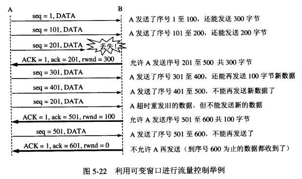

## 流量控制
* 流量控制，主要是接收方传递信息给发送方，使其不要发送数据太快，是一种端到端的控制。
* 主要方式是返回的ACK中会包含自己的接收窗口的大小，并且利用大小来控制发送方的数据发送：

    
#### 计时器
这里面涉及到一种情况：如果B已经告诉A自己的缓冲区已满，于是A停止发送数据；等待一段时间后，B的缓冲区出现了富余，于是给A发送报文告诉A我的rwnd大小为400，但是这个报文不幸丢失了，于是就出现A等待B的或者B等待A发送数据的死锁状态。为了处理这种问题，TCP引入了持续计时器（Persistence timer），当A收到对方的零窗口通知时，就启用该计时器，时间到则发送一个1字节的探测报文，对方会在此时回应自身的接收窗口大小，如果结果仍未0，则重设持续计时器，继续等待。

## 拥塞控制
拥塞控制目的为了防止过多的数据注入到网络中，这样可以使网络中的路由器或链路不致过载。常用的方法就是：
1. 慢启动、拥塞控制
2. 快重传、快恢复

#### 慢启动、拥塞控制
1. cwnd < ssthresh， 继续使用慢启动算法（指数增加）；
2. cwnd > ssthresh，停止使用慢启动算法，改用拥塞避免算法（线性增加）；
3. 当出现网络拥塞，比如丢包时，将慢启动门限（ssthresh）设为原先的一半，然后将cwnd设为1，执行慢启动算法；

#### 快重传、快恢复
快重传和快恢复是为了减少因为拥塞导致的数据包丢失带来的重传时间，从而避免传递无用的数据到网络。快重传的机制是：
1. 接收方建立这样的机制，如果一个包丢失，则对后续的包继续发送针对该包的重传请求；
2. 一旦发送方接收到三个一样的确认，就知道该包之后出现了错误，立刻重传该包； 
3. 此时发送方开始执行“快恢复”算法：
    1. 慢启动门限减半；
    2. cwnd设为慢启动门限减半后的数值；
    3. 执行拥塞避免算法（高起点，线性增长）；

