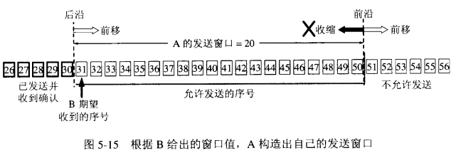

## 滑动窗口协议
* “窗口”对应的是一段可以被发送者发送的**字节序列**，其连续的范围称之为“窗口”
* “滑动”是指这段“允许发送的范围”是可以随着发送的过程而变化的，方式就是按顺序“滑动”。

1. 发送窗口是发送缓存中的一部分，是可以被TCP协议发送的那部分，其实应用层需要发送的所有数据都被放进了发送者的发送缓冲区；
2. 发送窗口中有四种状态：
    1. 已发送并收到确认的数据（不再发送窗口和发送缓冲区之内）
    2. 已发送但未收到确认的数据（位于发送窗口之中）
    3. 允许发送但尚未发送的数据
    4. 发送窗口外发送缓冲区内暂时不允许发送的数据；
3. 每次成功发送数据之后，发送窗口就会在发送缓冲区中按顺序移动，将新的数据包含到窗口中准备发送；
    
 TCP建立连接的初始，B会告诉A自己的接收窗口大小，比如为20：

A发送11个字节后，发送窗口位置不变，B接收到了乱序的数据分组：

只有当A成功发送了数据，即发送的数据得到了B的确认之后，才会移动滑动窗口离开已发送的数据；同时B则确认连续的数据分组，对于乱序的分组则先接收下来，避免网络重复传递：

